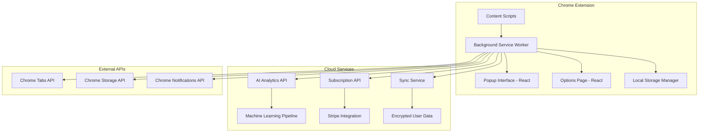

# Design Document

## Overview

TabGuard Pro is architected as a modern Chrome extension using Manifest V3, with a React-based popup interface, background service worker for tab management, and cloud-based AI analytics. The system follows a modular architecture with clear separation between tab management, AI processing, user interface, and subscription management components.

## Architecture

### High-Level Architecture



### Core Components

1. **Background Service Worker**: Central orchestrator for tab management and API communication
2. **Tab Manager**: Enforces limits and tracks tab lifecycle
3. **AI Analytics Engine**: Processes browsing patterns and generates insights
4. **UI Components**: React-based popup and options interfaces
5. **Subscription Manager**: Handles premium features and billing
6. **Sync Engine**: Cross-device data synchronization

## Components and Interfaces

### 1. Background Service Worker

**Purpose**: Central hub for all extension functionality

**Key Responsibilities**:
- Monitor tab creation/closure events
- Enforce tab limits across all windows
- Coordinate with AI analytics service
- Handle subscription state management
- Manage cross-device synchronization

**Interfaces**:
```typescript
interface BackgroundService {
  tabManager: TabManager;
  aiAnalytics: AIAnalyticsEngine;
  subscriptionManager: SubscriptionManager;
  syncEngine: SyncEngine;
  
  onTabCreated(tab: chrome.tabs.Tab): Promise<void>;
  onTabRemoved(tabId: number): Promise<void>;
  onTabUpdated(tabId: number, changeInfo: chrome.tabs.TabChangeInfo): Promise<void>;
}
```

### 2. Tab Manager

**Purpose**: Core tab limiting and management logic

**Key Features**:
- Real-time tab counting across windows
- Smart tab closure suggestions
- Rule-based tab management
- Performance monitoring

**Interfaces**:
```typescript
interface TabManager {
  getCurrentTabCount(): Promise<number>;
  enforceTabLimit(limit: number): Promise<boolean>;
  getSuggestedTabsToClose(): Promise<TabSuggestion[]>;
  closeInactiveTabs(criteria: InactivityCriteria): Promise<void>;
  applyRules(rules: TabRule[]): Promise<void>;
}

interface TabSuggestion {
  tabId: number;
  title: string;
  url: string;
  lastAccessed: Date;
  memoryUsage: number;
  productivityScore: number;
}
```

### 3. AI Analytics Engine

**Purpose**: Provide intelligent insights and recommendations

**Key Features**:
- Browsing pattern analysis
- Productivity scoring
- Personalized recommendations
- Performance impact analysis

**Interfaces**:
```typescript
interface AIAnalyticsEngine {
  analyzeProductivity(sessions: BrowsingSession[]): Promise<ProductivityInsights>;
  categorizeWebsite(url: string): Promise<WebsiteCategory>;
  generateRecommendations(userProfile: UserProfile): Promise<Recommendation[]>;
  calculateOptimalTabLimit(usage: UsagePattern): Promise<number>;
}

interface ProductivityInsights {
  productivityScore: number;
  timeDistribution: CategoryTimeMap;
  focusMetrics: FocusMetrics;
  recommendations: string[];
}
```

### 4. React UI Components

**Purpose**: Provide intuitive user interfaces

**Component Structure**:
```
src/
├── popup/
│   ├── components/
│   │   ├── TabCounter.tsx
│   │   ├── QuickActions.tsx
│   │   ├── ProductivityWidget.tsx
│   │   └── SettingsButton.tsx
│   └── PopupApp.tsx
├── options/
│   ├── components/
│   │   ├── TabLimitSettings.tsx
│   │   ├── RulesManager.tsx
│   │   ├── ThemeSelector.tsx
│   │   ├── SubscriptionPanel.tsx
│   │   └── AnalyticsDashboard.tsx
│   └── OptionsApp.tsx
└── shared/
    ├── components/
    └── hooks/
```

### 5. Subscription Manager

**Purpose**: Handle premium features and billing

**Key Features**:
- Stripe integration for payments
- Feature flag management
- License validation
- Team/enterprise management

**Interfaces**:
```typescript
interface SubscriptionManager {
  getCurrentPlan(): Promise<SubscriptionPlan>;
  upgradeSubscription(planId: string): Promise<boolean>;
  validateLicense(): Promise<boolean>;
  getFeatureAccess(feature: string): Promise<boolean>;
  manageTeamLicenses(teamId: string): Promise<TeamLicense[]>;
}
```

## Data Models

### Core Data Structures

```typescript
// User Configuration
interface UserConfig {
  tabLimit: number;
  autoCloseEnabled: boolean;
  autoCloseDelay: number; // minutes
  theme: 'light' | 'dark' | 'auto';
  notificationsEnabled: boolean;
  rules: TabRule[];
  profiles: UserProfile[];
}

// Tab Management Rules
interface TabRule {
  id: string;
  name: string;
  condition: RuleCondition;
  action: RuleAction;
  priority: number;
  enabled: boolean;
}

interface RuleCondition {
  type: 'domain' | 'category' | 'time' | 'tab_count';
  operator: 'equals' | 'contains' | 'greater_than' | 'less_than';
  value: string | number;
}

// Analytics Data
interface BrowsingSession {
  sessionId: string;
  startTime: Date;
  endTime: Date;
  tabs: TabActivity[];
  productivityScore: number;
  memoryUsage: MemoryMetrics;
}

interface TabActivity {
  tabId: number;
  url: string;
  title: string;
  timeActive: number; // milliseconds
  category: WebsiteCategory;
  memoryUsage: number;
}

// Subscription Data
interface SubscriptionPlan {
  id: string;
  name: string;
  price: number;
  features: string[];
  tabLimit: number;
  aiInsights: boolean;
  teamFeatures: boolean;
}
```

## Error Handling

### Error Categories and Strategies

1. **Tab Management Errors**
   - Chrome API failures: Graceful degradation with user notification
   - Permission issues: Clear instructions for re-enabling permissions
   - Memory constraints: Automatic fallback to more conservative limits

2. **AI Service Errors**
   - Network failures: Cache last insights, retry with exponential backoff
   - API rate limits: Queue requests and batch processing
   - Invalid data: Sanitize inputs and provide default recommendations

3. **Subscription Errors**
   - Payment failures: Clear error messages with retry options
   - License validation: Graceful downgrade to free tier
   - Sync conflicts: Last-write-wins with user notification

4. **UI Errors**
   - Component crashes: Error boundaries with fallback UI
   - State corruption: Reset to default state with user confirmation
   - Performance issues: Lazy loading and virtualization

### Error Recovery Mechanisms

```typescript
interface ErrorHandler {
  handleTabError(error: TabError): Promise<void>;
  handleAIError(error: AIError): Promise<void>;
  handleSubscriptionError(error: SubscriptionError): Promise<void>;
  handleUIError(error: UIError): Promise<void>;
}

// Retry Strategy
interface RetryConfig {
  maxAttempts: number;
  backoffMultiplier: number;
  maxDelay: number;
}
```

## Testing Strategy

### Testing Pyramid

1. **Unit Tests (70%)**
   - Tab management logic
   - AI analytics functions
   - Subscription validation
   - UI component behavior
   - Data model validation

2. **Integration Tests (20%)**
   - Chrome API interactions
   - Background service worker communication
   - Cloud service integration
   - Cross-component data flow

3. **End-to-End Tests (10%)**
   - Complete user workflows
   - Subscription upgrade/downgrade
   - Multi-window tab management
   - Cross-device synchronization

### Testing Tools and Framework

- **Unit Testing**: Jest + React Testing Library
- **Integration Testing**: Chrome Extension Testing Framework
- **E2E Testing**: Playwright with Chrome extension support
- **Performance Testing**: Chrome DevTools Performance API
- **Load Testing**: Artillery for cloud services

### Test Scenarios

```typescript
// Critical Test Cases
describe('Tab Management', () => {
  test('enforces tab limit across multiple windows');
  test('suggests optimal tabs for closure');
  test('handles rapid tab creation/closure');
  test('maintains performance under high tab counts');
});

describe('AI Analytics', () => {
  test('categorizes websites accurately');
  test('generates meaningful productivity insights');
  test('handles privacy-sensitive data correctly');
  test('provides personalized recommendations');
});

describe('Subscription Management', () => {
  test('validates premium features access');
  test('handles payment processing errors');
  test('manages team license distribution');
  test('synchronizes subscription state');
});
```

### Performance Benchmarks

- Tab limit enforcement: < 50ms response time
- UI interactions: < 200ms for all actions
- AI insights generation: < 2 seconds
- Memory footprint: < 50MB for extension
- Sync operations: < 5 seconds for full sync

### Security Considerations

1. **Data Privacy**
   - Local storage encryption for sensitive data
   - Minimal data collection with explicit consent
   - GDPR/CCPA compliance mechanisms

2. **API Security**
   - JWT tokens for authentication
   - Rate limiting on all endpoints
   - Input validation and sanitization

3. **Extension Security**
   - Content Security Policy enforcement
   - Minimal permissions model
   - Secure communication channels

This design provides a robust foundation for building a premium Chrome extension that can scale to meet your revenue goals while delivering exceptional user value through AI-powered productivity features.